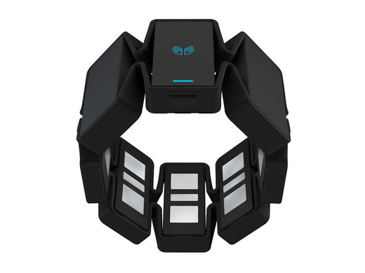

# MyoSteuerung

Meine Bachelorarbeit für mein Studium Computer Engineering.

Ich verwende das Gestensteuerungsgerät "Myo" zur Steuerung einer Präsentation. Dadurch wird die Verwendung von Bluetooth-Fernbedienungen oder ähnlichen nicht mehr benötigt. Damit die Software die Gesten lernen kann nutze ich ein neuronales Netz, welches ich mit der DLL MemBrain (www.membrain-nn.de) aufgebaut habe.

Zum Starten wird das Programm Myo Connect benötigt zum erstellen einer Verbindung

Link: https://developer.thalmic.com/downloads
